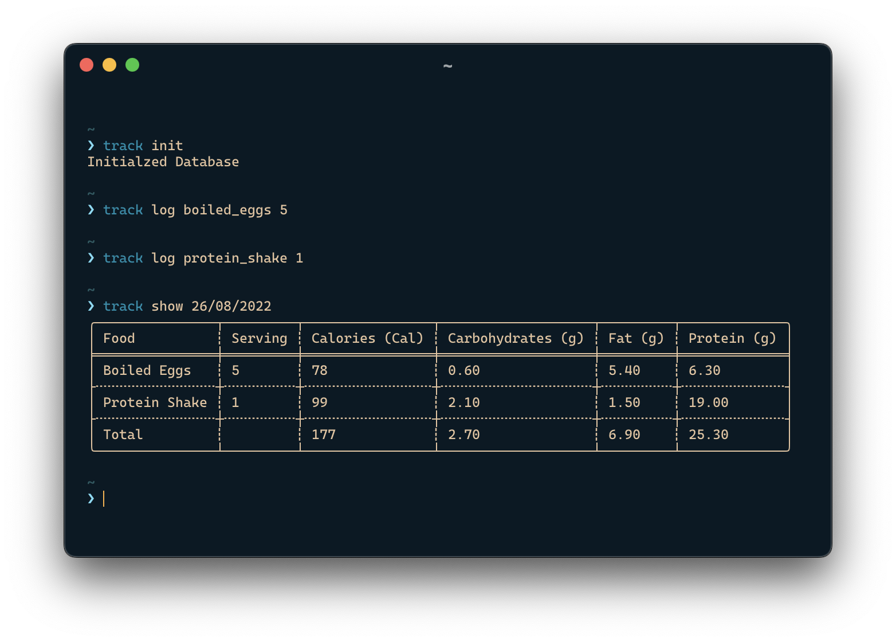

# Track
A CLI app to track your diet.

# TODO
- [ ] Add Error Handling
- [ ] Colored Output
- [ ] Migrate to [Diesel.rs](https://diesel.rs)
- [ ] Add `default_value_t` for `show()`
- [ ] Add logging
- [ ] Add styling for table
- [ ] Add limits for calorie, fat etc.
- [ ] Make `init` command implicit
- [ ] Merge `get_food_id()` and `log()`
